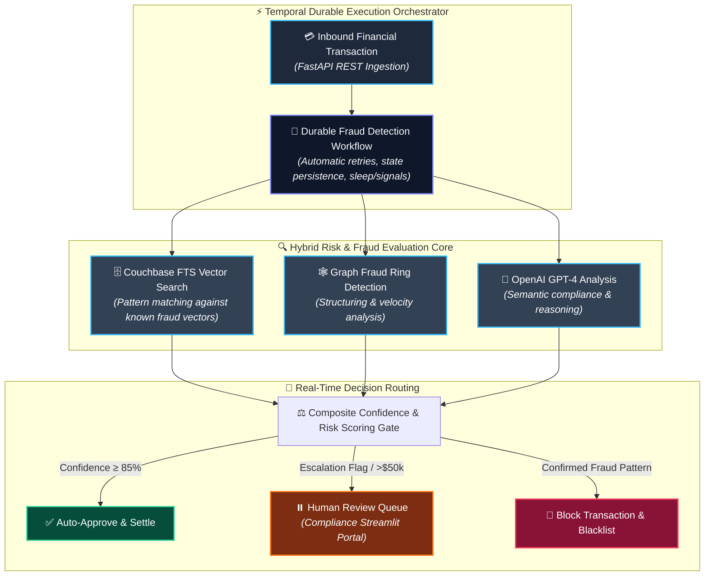

# Temporal AI Fraud Detection & Transaction Processing System 💳⚡

[](https://www.python.org/downloads/)
[](https://temporal.io)
[](https://www.couchbase.com)
[](https://fastapi.tiangolo.com)
[](LICENSE)
[](https://github.com/blue007-arc)

An enterprise-grade, distributed financial transaction processing and intelligent fraud detection system combining **Temporal durable workflows**, **Couchbase vector similarity search**, and **LLM reasoning** for real-time risk assessment, velocity checks, and human-in-the-loop review queues.

Developed and maintained by **[Sakshi Pandey](https://github.com/blue007-arc)** (`231FA04H01@gmail.com`).

---

## 🏗️ Architecture Overview



---

## 🌟 Key Capabilities

- **⚡ Resilient Workflow Orchestration**: Powered by **Temporal**, guaranteeing that long-running transaction evaluations survive network blips, database restarts, and process crashes without losing state.
- **🔍 Hybrid Risk Engine**:
  - **Vector Similarity Search**: Matches transaction embeddings against historical fraudulent patterns using Couchbase Full-Text Search.
  - **Graph Fraud Ring Detection**: Detects structuring, rapid movement across accounts, and suspicious clusters.
  - **LLM Reasoning**: Evaluates semantic flags with explainable audit trails.
- **🛡️ Human-in-the-Loop (HITL) Queue**: High-value or borderline transactions (> $50,000 or confidence < 85%) trigger an escalation workflow awaiting compliance officer sign-off.
- **📊 Real-time Monitoring Dashboard**: Streamlit interface displaying real-time transactions, decision latency, audit logs, and interactive manual review queues.

---

## 🛠️ Tech Stack

- **Workflow Engine**: [Temporal](https://temporal.io) (Durable Execution)
- **Backend API**: [FastAPI](https://fastapi.tiangolo.com) + Uvicorn
- **Database & Vector Search**: [Couchbase Server](https://www.couchbase.com) (Full-Text Search & Vector Indexes)
- **AI Core**: OpenAI (GPT-4 / GPT-4o-mini & `text-embedding-3-small`)
- **Dashboard UI**: [Streamlit](https://streamlit.io)
- **Deployment**: Docker & Docker Compose

---

## 📁 Repository Structure

```text
temporal-ai-fraud-detection/
├── api/                    # FastAPI REST endpoints for transaction ingestion
├── temporal/               # Temporal workflow & activity definitions
├── database/               # Couchbase connection & vector search helpers
├── ai/                     # LLM fraud reasoning & embedding generation
├── scripts/                # Database initialization & simulation scripts
├── utils/                  # Logging and configuration utilities
├── app.py                  # Streamlit real-time monitoring & review dashboard
├── requirements.txt        # Python package dependencies
├── .env.example            # Environment configuration template
├── .gitignore              # Git ignore rules
└── LICENSE                 # Apache 2.0 license
```

---

## ⚡ Quick Start

### 1. Prerequisites
- Python 3.11+
- Docker & Docker Compose
- OpenAI API Key
- Couchbase Server or Couchbase Capella account

### 2. Installation

```bash
# Clone the repository
git clone https://github.com/blue007-arc/temporal-ai-fraud-detection.git
cd temporal-ai-fraud-detection

# Create virtual environment
python -m venv venv
source venv/bin/activate  # On Windows: venv\Scripts\activate

# Install dependencies
pip install -r requirements.txt
```

### 3. Configure Environment

```bash
cp .env.example .env
```

Edit `.env` with your API keys and Couchbase credentials:
```env
COUCHBASE_CONNECTION_STRING=couchbase://localhost
COUCHBASE_USERNAME=Administrator
COUCHBASE_PASSWORD=password
OPENAI_API_KEY=your_openai_api_key
TEMPORAL_HOST=localhost:7233
```

### 4. Running the System

Start the infrastructure and services (in separate terminals):

```bash
# Terminal 1: Start Temporal Worker
python -m temporal.run_worker

# Terminal 2: Start REST API
uvicorn api.main:app --reload --port 8000

# Terminal 3: Start Admin Dashboard
streamlit run app.py
```

Open `http://localhost:8501` to view the live dashboard.

---

## 🧪 Testing Fraud Scenarios

Submit a test transaction via `curl`:

```bash
curl -X 'POST' \
  'http://localhost:8000/api/transaction' \
  -H 'Content-Type: application/json' \
  -d '{
    "transaction_id": "TX-990214",
    "transaction_type": "wire_transfer",
    "amount": 75000,
    "currency": "USD",
    "sender": {"account_number": "ACC-101", "country": "US", "name": "Jane Doe"},
    "recipient": {"account_number": "ACC-909", "country": "KY", "name": "Offshore Corp"},
    "risk_flags": ["high_amount", "offshore_jurisdiction"]
  }'
```

Watch the workflow trigger in Temporal, flag the high amount and jurisdiction, and automatically route to the **Human Review Queue** on the Streamlit dashboard.

---

## 👤 Author & Maintainer

**Sakshi Pandey**
- GitHub: [@blue007-arc](https://github.com/blue007-arc)
- Email: [231FA04H01@gmail.com](mailto:231FA04H01@gmail.com)

---

## 📄 License
This project is licensed under the Apache License 2.0 - see the [LICENSE](LICENSE) file for details.
